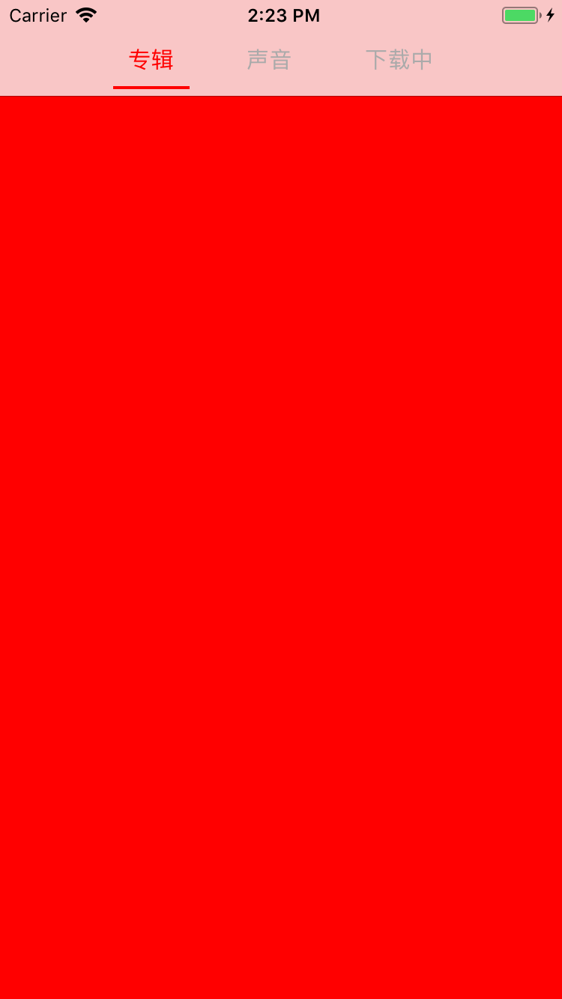

# LBTools

[](https://travis-ci.org/812920365@qq.com/LBTools)
[](http://cocoapods.org/pods/LBTools)
[](http://cocoapods.org/pods/LBTools)
[](http://cocoapods.org/pods/LBTools)

## Example

To run the example project, clone the repo, and run `pod install` from the Example directory first.

## Requirements

## Installation

使用cocoapods:

```ruby
pod 'LBTools'
```
导入头文件

```ruby
#import 'LBSebmentBarVC.h'
```
把添加的LBSebmentBarVC控制器作为你创建的控制的子控制器:
```ruby

self.segmentBarVC.segmentBar.frame = CGRectMake(0, 0, 300, 35);
self.segmentBarVC.segmentBar.backgroundColor = [UIColor greenColor];
self.navigationItem.titleView = self.segmentBarVC.segmentBar;

self.segmentBarVC.view.frame = self.view.bounds;
[self.view addSubview:self.segmentBarVC.view];


NSArray *items = @[@"专辑", @"声音", @"下载中"];

// 添加几个自控制器
// 在contentView, 展示子控制器的视图内容

UIViewController *vc1 = [UIViewController new];
vc1.view.backgroundColor = [UIColor redColor];

UIViewController *vc2 = [UIViewController new];
vc2.view.backgroundColor = [UIColor greenColor];

UIViewController *vc3 = [UIViewController new];
vc3.view.backgroundColor = [UIColor yellowColor];


[self.segmentBarVC setUpWithItems:items childViewControllers:@[vc1, vc2, vc3]];


//        XMGSegmentBarConfig *config = [XMGSegmentBarConfig defaultConfig];
//        config.itemFont = ;
//
//        self.segmentBarVC.segmentBar.config = config;

//添加选项卡的基本设置
[self.segmentBarVC.segmentBar updateWithConfig:^(LBSegmentBarConfig *config) {

//            config.segmentBarBackColor = [UIColor cyanColor];
//            config.itemNormalColor = [UIColor brownColor];
//            config.itemSelectColor = [UIColor yellowColor];
//            config.itemSC([UIColor brownColor]).itemNC([UIColor yellowColor]);

config.itemNC([UIColor redColor]).itemSC([UIColor orangeColor]).indicatorEW(10);
//            config.itemFont = [UIFont fontWithName:@"Zapfino" size:10];
//
//            config.indicatorHeight = 5;
//            config.indicatorColor = [UIColor blueColor];
//            config.indicatorExtraW = 0;

}];
```
或者是继承LBSebmentBarVC类,重写方法:
```ruby
-(void)setUpWithItems:(NSArray <NSString *>*)items childViewControllers:(NSArray <UIViewController *>*)childViewControllers;
```

## 效果图


### [作者简书地址](http://www.jianshu.com/u/75e18a4ed4db)
## Author

作者:卟师, 812920365@qq.com

## License

LBTools is available under the MIT license. See the LICENSE file for more info.
